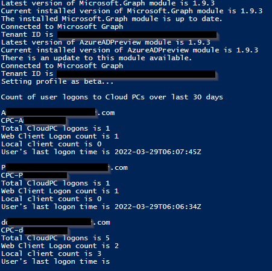

# Windows 365 User Logon Activity Script
Currently Windows 365 does not have a way to report how often users are actually using their CloudPC. This example script aims to provide that information by querying the Azure AD Logon logs and comparing this data against every user who has a provisioned Cloud PC. The script returns a count of every logon a user has completed against their Cloud PC, as well as their last logon time. The script does not return session duration.

This script is provided as an example. Support will not be provided. 

## Required PowerShell Modules

This script uses two PowerShell modules to ingest data. Microsoft.Graph for CloudPC metadata and AzureADPreview to get the logon information. The script only installs the Microsoft.Graph modules it needs to run the CloudPC commandlets, not the entire Microsoft.Graph module. These modules are:

- Microsoft.Graph.DeviceManagement.Functions
- Microsoft.Graph.DeviceManagement.Administration
- Microsoft.Graph.DeviceManagement.Enrolment
- Microsoft.Graph.Users.Functions
- Microsoft.Graph.DeviceManagement.Actions
- Microsoft.Graph.Users.Actions

> **If the computer running this script has the AzureAD module installed, there may be conflicts with the AzureADPreview module. It may be required to uninstall the AzureAD module to avoid the conflict**

## Usage

When the script is run, it will check if the Microsoft.Graph modules are installed and will install them if not present. It will then check if the AzureADPreview module is installed and will install if not present. It will then attempt to connect both modules to Azure. As these are separate modules with separate Enterprise App connections, there will be two credential prompts.

Once the user has authenticated, the script will set the connection to Microsoft.Graph to Beta.

The script will then query all CloudPCs against their respective logons and output the data to the console and the CSV file.

## Output
The following are examples of both the console and the CSV output.

## Parameters

-Offset

This value is the amount of days back that logons should be collected for. The default value is 30. Setting this parameter in commandline is optional.

-Logpath

This value is where the CSV output should be written to, as well as the file name. The default value is "C:\CPC_Logon_Count.csv". Setting this parameter in commandline is optional.

